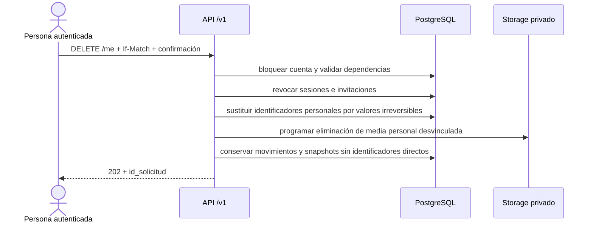

# Secuencia objetivo · Anonimización de cuenta

La implementación debe ser idempotente, auditable y verificable. Los plazos de
retención, excepciones legales y texto público continúan pendientes de revisión
profesional; `PR-07` no autoriza prometer borrado absoluto del ledger.
