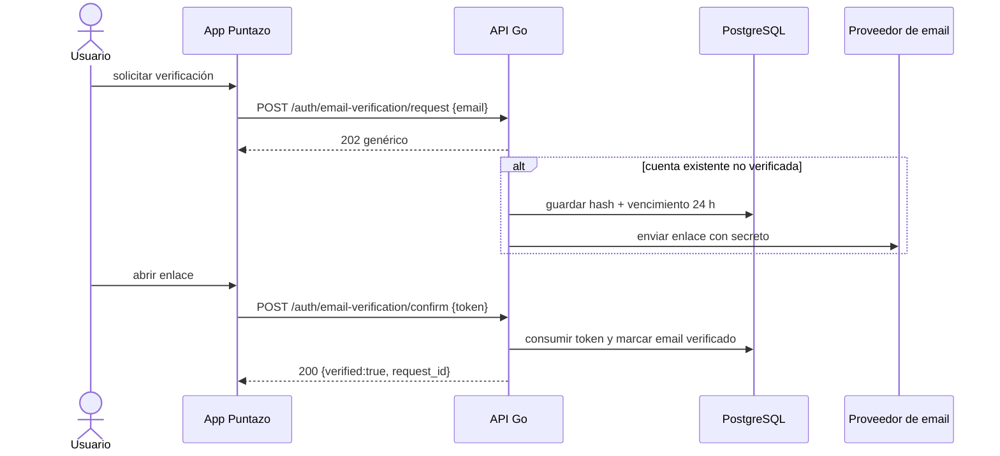

# Secuencia · Verificación de email

> **APROBADA `PR-09`; `NOT_IMPLEMENTED`.** Requiere proveedor de correo operativo
> antes de producción y evidencia de entrega, expiración y consumo único.

La respuesta de solicitud y su latencia observable no deben revelar si el email
existe o ya estaba verificado. El secreto sólo aparece en el mensaje; base y logs
conservan su hash. Reuso, vencimiento o token inválido devuelven un error genérico.
