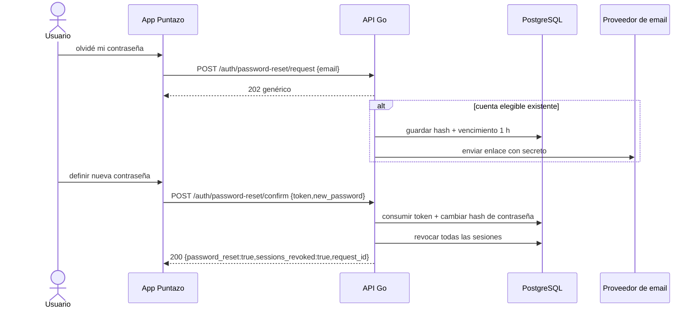

# Secuencia · Recuperación de contraseña

> **APROBADA `PR-09`; `NOT_IMPLEMENTED`.** Requiere proveedor de correo operativo
> antes de producción y pruebas de expiración, reuso y revocación completa.

La solicitud no revela existencia, método de acceso ni estado de la cuenta. El
secreto no se persiste ni se registra en claro. Confirmar no entrega una sesión:
la persona vuelve a autenticarse con la nueva contraseña.
